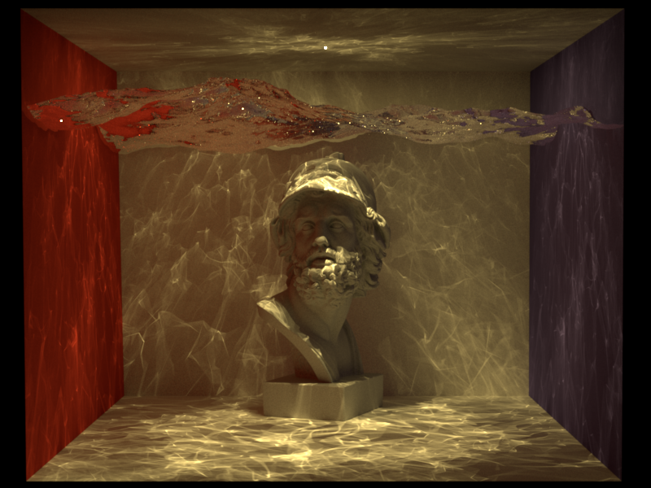

# BDPT-Nori

BDPT-Nori is a reference implementation of **Bidirectional Path Tracing (BDPT)** built on top of [**Nori**](https://rgl.epfl.ch/software/Nori2), the educational renderer developed and open-sourced by [**Prof. Wenzel Jakob**](https://rgl.epfl.ch/people/wjakob).

This project is **not intended to be a complete, plug-and-play renderer**. Instead, it serves as a **learning-oriented implementation** aimed at helping graphics enthusiasts better understand how BDPT can be implemented in a real rendering system.

---

## Background

Nori is a teaching-oriented renderer designed for Prof. Wenzel Jakob’s rendering courses. Its clean structure makes it an excellent platform for experimenting with path tracing algorithms and their variants.

Based on Nori, this project implements a **Bidirectional Path Tracing integrator**, along with a small number of necessary extensions to the underlying infrastructure.

⚠️ **Important Note (Course Policy Compliance)**  
In accordance with Prof. Wenzel Jakob’s course policies:

- This repository **does NOT contain solutions to any Nori course assignments**
- It **does NOT include** the full Nori source code
- Only the following are provided:
  - The BDPT integrator implementation
  - A few modified base files strictly required to support BDPT

---

## Contents

This repository mainly contains:

- **BDPT Integrator**
  - The core implementation of Bidirectional Path Tracing
- **Minimal Required Infrastructure Changes**
  - `block.h` / `block.cpp`  
    - Extensions required for pixel/sample accumulation in LightImage.
  - `main.cpp`
    - Augmentation related to `lightImage` for `t=1` technique.
- **The Scene *Ajax under water***

All other core components of Nori (e.g., BSDFs, Emitters, Scene, Samplers, etc.) are **not included** in this repository.

---

## Prerequisites

To run or reproduce this project, you are expected to complete the following steps:

1. **Clone and build the official Nori repository**
   - Make sure the original Nori renderer runs correctly

2. **Implement the basic Nori components following the course material**
   - Including, but not limited to:
     - BSDF / Emitter
     - Scene / Acceleration Structures
     - Warping
   - This project assumes you already have a functional Nori implementation

3. **Extend your implementation with additional interfaces**
   - The BDPT implementation in this repository depends on several additional class interfaces (Indicated clearly by their names.)
   - Please refer directly to the source code for details

---

## Tested Environment

- Operating System: **Windows 11**
- Build configuration: consistent with the official Nori setup

> Other platforms (Linux / macOS) have not been systematically tested, but the implementation should be largely platform-independent.

---

## Intended Audience

This project is best suited for readers who:

- Already understand Path Tracing
- Have basic familiarity with BDPT theory (e.g., Veach’s thesis, PBRT)
- Want to study the **mapping from algorithmic concepts to concrete code structure**

If you are looking for a **production-ready or industrial-strength** BDPT renderer, this project is not for you.  
If you are looking for a **readable, modifiable, and inspectable** BDPT reference, it may be useful.

---

## Acknowledgements

- **Wenzel Jakob**
  - For open-sourcing Nori and providing a rigorous and well-structured rendering curriculum
- **Eric Veach**  
  - For his seminal 1997 Ph.D. thesis, ***ROBUST MONTE CARLO METHODS  FOR LIGHT TRANSPORT SIMULATION***, which laid the theoretical foundations of modern Monte Carlo light transport, including path integrals, multiple importance sampling, and bidirectional path tracing.
- **Ling-Qi Yan**  
  - For providing valuable theoretical guidance and clarifications that helped resolve critical conceptual issues related to bidirectional path tracing.

- Everyone contributing to open graphics education and open-source rendering research

---

## Disclaimer

- This code is provided for learning and reference purposes only
- No guarantees are made regarding numerical robustness, performance, or edge-case coverage
- Please evaluate and adapt the implementation critically
